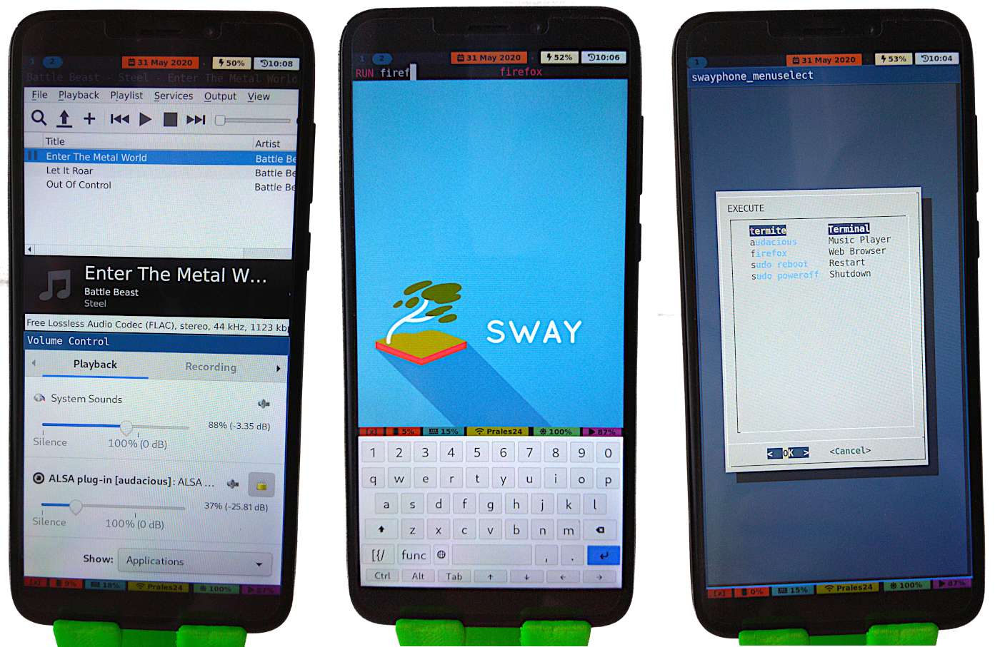

# pinephone-sway-poc
Sway UI configured for PINE64 PinePhone (Proof Of Concept)

You can find ready-made config files, scripts and installation instructions on how to set up Sway on postmarketOS and use it with a PinePhone.



## Install
Start with a [postmarketOS](https://wiki.postmarketos.org/wiki/PINE64_PinePhone_(pine64-pinephone)) for PinePhone image with `postmarketos-ui-sway` installed. Either use the pre-built demo image or build a custom one with `pmbootstrap`.

Flash the system onto the phone (either to an SD card or directly to the eMMC with Jumpdrive).

Open a terminal on the phone (either through SSH, the serial connection or directly on the screen) and run this:
```
# components
$ sudo apk add waybar bemenu swaylock swayidle squeekboard networkmanager htop pavucontrol bash dialog

# build tools
$ sudo apk add git make meson ninja cargo linux-headers libinput-dev eudev-dev

# installation
$ git clone --recurse-submodules https://github.com/Dejvino/pinephone-sway-poc
$ cd pinephone-sway-poc
$ make install_user
$ sudo make install_system
```

That's it. You should now have everything in place. Reboot to use the new settings.

## Usage
Study the provided config files and shell scripts to get more details. The following is just an introduction.

### Power Button
The power button activates or deactivates a "sleep mode", in which the backlight is turned off, all the CPUs except for the primary one are shut down and the red LED is turned on to indicate the phone is turned on.

### Top and bottom waybar
The bars show you CPU/MEM usage, backlight brightness, time, etc. Touching them opens a relevant app (e.g. NetworkManager or htop). Touching the date opens a custom "quick execute" menu to launch an app. The **[x]** icon closes the active window. Touching the backlight indicator brings up a custom brightness setting app.

### Touch gestures
Swiping two fingers up / down activates or hides the on-screen keyboard. Swiping two fingers left / right changes the active workspace. Three fingers change the active window in the direction of the swipe. Four fingers move the active window accordingly.

### Screen Rotation
The screen is automatically rotated based on the readings from the phone's built-in accelerometer.

## TIP!
You can use this as a configs backup mechanism!
```
$ make fetch
```
Running this command gathers the relevant config files from your running system and replaces the files in the repository. You can then `git add` and `commit` your own changes, straight from the phone! This is actually how the config files here were created.

## Components
* postmarketOS - base Linux distribution (though any other would work as well)
* sway (pmos package) - tiling Wayland compositor
* * swayidle, swaylock - utils for sway
* bemenu (pmos package) - app launcher
* waybar (pmos package) - Wayland status bar
* * [carlosdss22/dotfiles](https://github.com/carlosdss22/dotfiles/tree/master/waybar) - styles used
* squeekboard (pmos package) - on-screen keyboard for Wayland
* * [terminal.yaml](https://source.puri.sm/btantau/squeekboard/blob/btantau-master-patch-76686/data/keyboards/terminal.yaml) - keyboard layout based on this improved version
* [pinephone-toolkit](https://github.com/Dejvino/pinephone-toolkit) - various utilities for the PinePhone
* [sxmo-lisgd](https://git.sr.ht/~mil/lisgd) - gesture detection daemon
* [rot8](https://github.com/efernau/rot8) - screen rotation daemon using data from the accelerometer
* htop (pmos package) - Processes monitoring
* pavucontrol (pmos package) - PulseAudio control panel

(*pmos package* = available as a package directly from the postmarketOS repository)

